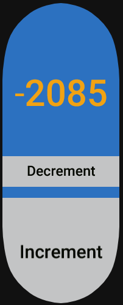

# Custom App Example for Mi Band 7



This is an example test project I created in order to test custom app development for the Mi Band 7.

## Development

This repo includes a `zepp-api.d.ts` and `jsconfig.json` which are intended to make the development environment reflect the global modules and objects a watch app should have access to.

Some elements of the Mock JS environment were taken from https://github.com/melianmiko/ZeppPlayer/

### Simulate in ZeppPlayer

The best tool for simulating an App on the Mi Band 7 seems to be [Zepp Player](https://github.com/melianmiko/ZeppPlayer/). This app was built to be compatible with it.

## Build .bin archive
```bash
# rebuild assets
rm -rf assets/
mkdir assets/
cd assets/
npx wfjs convertPngToTga -i ../assets_png/icon.png -e tga
cd ..
zip -r my_custom_app.bin ./ -i "page/*" "assets/*" "app.json" "app.js"
```

## Install
I use GadetBridge to connect to my Mi Band, which automatically flashes bin files to the watch. I'm not sure how to do this with the official apps.

This project was based on [ATOMAS](https://amazfitwatchfaces.com/mi-band-7/view/460?hl=en), so it has the same APP ID. if you install this sample app without changing it, it will overwrite ATOMAS. This is on purpose, to make sure I don't take up unneccesary space with a sample app, as I'm still not sure how to remove them. To "Remove" the sample you can just re-install ATOMAS.